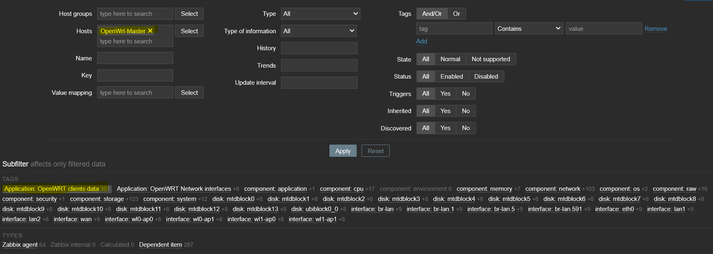

## Zabbix OpenWrt Clients monitor

This is a fork of @Merrick28's great work.
Available at https://github.com/Merrick28/zabbix-Openwrt-Clients-monitor.

I have done a rewrite of the template file for the latest Zabbix server version 7.4 and changed the shell scripts to lua. The discovery is about 7-8x faster that way and the client details are about 2x faster.
The actual data in Zabbix is now not queried in 4x separate steps anymore (bytes up, packets up, bytes down, packets down) but in a single step and the data is then filtered out in Zabbix as dependent items. This way, the overall data collection process is about 8x faster than it was before.


The purpose of this repository is to set up a data collector for OpenWrt clients, using zabbix-agent.
It gets download total bytes, upload total bytes, upload total packets, download total packets and total connections for every network device, ie client.

It doesn't contain any alert, the goal is only to get data, for example to create graphs.


### Prerequisites

This is obviously intended to be used to gather data for Zabbix server, so you must have Zabbix server installed somewhere in some manner.
For configuration of Zabbix server, please refer to the Zabbix documentation: https://www.zabbix.com/
This has been tested with the current version 7.4 installed as LXC in Proxmox. Should work with any Zabbix server.

You must have `zabbix-agent` installed and configured to be used with a zabbix server. Install the agent into OpenWRT with the following command in a terminal (or you can use the OpenWRT UI installing the software packages).
```
    opkg update
    opkg install zabbix-agentd zabbix-extra-network zabbix-extra-wifi
```
Configure the agent to work with your Zabbix server. Typically, that involves setting the Server address in the config file. Please read up the official documentation.
You must have luci-app-nlbwmon, lua and sudo installed on your OpenWRT device (Again, use a terminal or the browser UI):
```
    opkg update
    opkg install luci-app-nlbwmon
    opkg install sudo
    opkg install lua
```
Explanation:

`luci-app-nlbwmon` is installing `nlbwmon` and `nlbw` packages as dependencies. Those are measuring the forwards from lan to wan.

In theory, you only need to install nlwbmon, that does do all the work we need it to do, but the luci app is an easy and nice way if configuring the monitor.

It can also provide a nice UI as a control if everything is working as intended.

The user zabbix (created by the installer when you install zabbix-agentd) must be enabled to launch *`/usr/sbin/nlbw`* without password. That is because only admins are permitted to call `nlbw`.

In order to do that, please add the following line in your `/etc/sudoers.d/zabbix` (create a new file) file:
```
    Defaults:zabbix !log_allowed
    zabbix ALL=(ALL) NOPASSWD: /usr/sbin/nlbw
```
Note: The first line is optional and all it does is to avoid having a log entry every time the agent calls `nlbw`. That's a lot of logging.

### Installation

* copy the `openwrt_nlbwmon` file into `/etc/zabbix_agentd.conf.d` directory.
* create the `/etc/zabbix_agentd.conf.d/scripts` directory
* copy the `owrt_client_discover.lua` and the `owrt_client_detail.lua` in the `/etc/zabbix_agentd.conf.d/scripts` directory
* set them both as executable: `chmod +x *.lua`.
* restart the zabbix agent: `service zabbix_agentd restart`.
* import the `zbx_export_templates.yaml` file into your Zabbix server, and link it to your OpenWrt router.

For the last step, please refer to the Zabbix server documentation.

What you'll get in Zabbix after the template import is approximately this:


You'll link it to your host (which is your OpenWrt router) which is then having both the stndard linux template and the OpenWrt client template assigned 
`Linux by Zabbix agent, OpenWRT client network`:


When you click on the discovered items, you should get this:


Set your filter to your host and select `Application: OpenWRT clients data` for tags.


You'll grt a list of all connected clients.


Now you have achieved the data collection and you can create dashboards as you please.

The next step is have Grafana installed somewhere and install the Zabbix data source to it https://grafana.com/docs/plugins/alexanderzobnin-zabbix-app/latest/configuration/ and have beautiful graphs.
